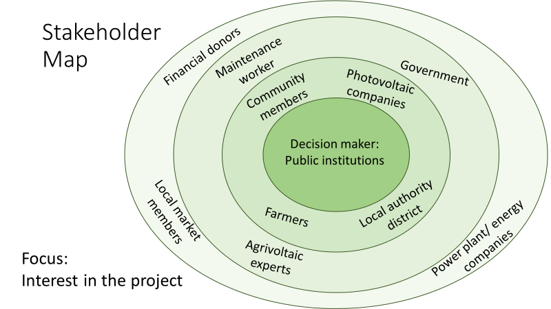
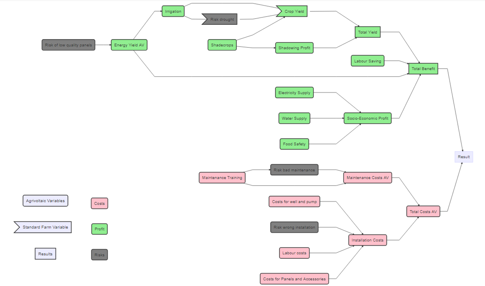
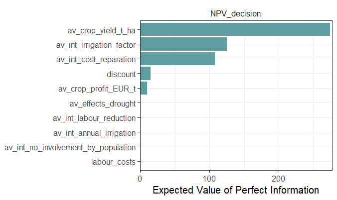
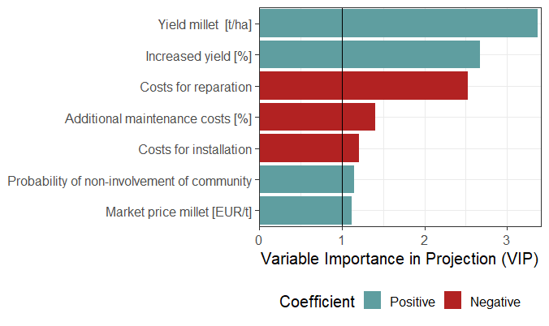
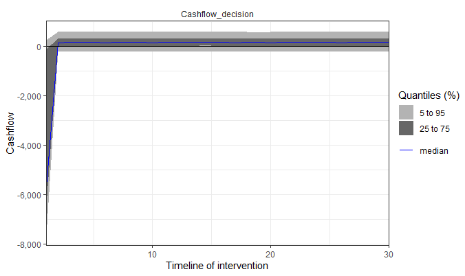

```{r setup, include=FALSE}
knitr::opts_chunk$set(echo = TRUE)
library(knitr)
library(decisionSupport)
library(readr)
library(DiagrammeR)
```
```{asis, add_packages_bib, include=FALSE}
knitr::write_bib(c(.packages(),
                   'decisionSupport', 'DiagrammeR'), 'bib/packages.bib')

bibliography: 
  - bib/references.bib 
  - bib/packages.bib
```


```{asis, echo=FALSE}
Note that the `echo = FALSE` parameter was added to the code chunk to prevent printing of the R code that generated the plot.

For citing: Figure - \@ref(fig:name) , Table - \@ref(tab:name)
```

# **Introduction**


# **Methods**

## Stakeholders

A Stakeholder is "any group or individual who is affected by or can affect the achievement of an organization's objectives" [@Freeman(A stakeholder Approach...)]. Stakeholder management is needed to balance the interests of all stakeholders with regard to their positions. Different stakeholders can have varying influence, depending on their position, to the result of the project outcome. For this project, communication did not take place with all stakeholders, and there was also not enough data to plot all stakeholders in a graph depending on their willingness to cooperate, their interest in the final goal or their influence on the decision maker for example.

The project has local stakeholders as well as those from abroad in the form of development aid organizations. To some extent, also the abroad government, as well as the population of the country and other groups that influence the decisions of the development aid organizations can be counted as stakeholders. At the local level there is the government, which becomes a stakeholder through political guidelines, but also through monetary grants. Many African countries are also striving for development goals, like the "Uganda Vision 2040" idea (@http://www.npa.go.ug/uganda-vision-2040/). The Malian government also has those goals, which include the generation of electricity via solar energy (@https://ideas4development.org/en/malian-agriculture-national-agricultural-development-bank-mali/). Future-oriented projects, like agrivoltaic systems, are therefore interesting for the government.

The projects are executed at farms, and therefore farmers play an important role in the question if those projects will succeed. A close communication between experts and farmers is essential to reduce risks, which could lead otherwise into difficulties. The addition of agrivoltaics aims to benefit not only the smallholder farmers directly, but also the surrounding community. An agrivoltaic system shared by smallholder farmers can lead to a close water access to new parts of rural areas. Other benefits for the community that can come with an agrivoltaic intervention are independent electricity, which can be used from charging mobile devices to cooling dairy products (@owusu-kwarteng) or medication inside a refrigerator (@opiyo). Photovoltaic supply companies play an important role while setting up an agrivoltaic systems. They need to contribute suitable solar panels devices, which can be installed and be maintained with the knowledge of locally available electricians. Those maintenance workers play a key role in the lifespan of those projects. And it is possible that with an increase in the use of solar panels, the number of learned electricians will also increase. An agrivoltaic intervention brings new growing conditions in the shade of the panels and irrigation possibilities with ground water pumps, which can be used to produce crops that would have been previously unable to grow. These new products can influence the local market place, transport processes or even nutrition deficits. More distant stakeholder are nearby communities, anyone who is groundwater dependent or power plant companies, although for stakeholder management these probably do not have to be considered (fig. \@ref(fig:stakeholders)).


```{r stakeholders, echo=FALSE, out.width='90%', fig.align='center', fig.cap="Stakeholder Overview"}

```


## Input Estimates
The estimates are given in ranges with 90% certainty and normally distributed. To produce reliable estimates, calibration is needed. Becoming a calibrated estimator, can be achieved with calibration tests, that help to improve the ability to correctly estimate ranges. The goal is to examine the own tendencies of misjudging and to use the new found knowledge for self-improvement. Constant values in the case of the experiment duration for example are also valid inputs. In combination with the model function, the input estimates are then used to calculate the Monte-Carlo simulation. The estimates were collected with two different methods.

The base of our estimates originates from literature research, which was conducted on experiments and publications with adaptable scenarios to the project. Care was taken to ensure that comparable conditions existed or that the values were interpolated and adapted to our case. For the literature, publications about agrivoltaics mostly in western Africa were of highest interest, but also other literature about photovoltaic and developing aid were considered. Input ranges with the topic of agriculture were estimated with the help of publications like [] .
For the variables regarding the topic of photovoltaic including costs, efficiency and production publications from [Raza et al, Shouman et al] were used. To estimate the ranges about the life and households in western Africa information was gathered in  [The economic lives of smallholder farmers].


```{r inputvariables, caption= "Table with the input variables", echo=FALSE, warning=FALSE}
library(knitr)
input_estimates <- read.csv("data/av_estimates_overview_updated_description.csv", header = TRUE, sep = ";")
input_estimates = subset(input_estimates, select = -c(median))
kable(input_estimates[2:7])
```

## Conceptual Model 
```{r conmodel, out.width='90%', fig.align='center', fig.cap="Conceptual Model", echo=FALSE}

```

## Questionnaire
After we determined estimates for the input variables based on the literature research, we then decided to create a questionnaire to get more precise values. The idea was to send it to several experts who work on similar projects, have experience with photovoltaic systems or agriculture in Africa, as well as farmers in West Africa who could give us valuable information about current market prices and general agricultural conditions. 

The questionnaire included agricultural related questions (e.g. “Estimate the impact of a severe drought on the yield of millet in [%] on a standard farm.”), technical questions about the photovoltaic system (e.g.''Estimate the potential annual costs for general maintenance of an agrivoltaic system (e.g. repairs, cleaning, preventive maintenance etc.)”) as well as questions related to irrigation (e.g. ”Estimate the potential yield increase in [%] with an irrigation system.”). It was structured so that the participants had to estimate a range for each variable and were able to skip the questions they were not certain about. We contacted a number of experts, but unfortunately not many participants completed the questionnaire.

## Code 


# **Results and Discussion**

## Net Present Value (NPV) distributions
## EVPI, VIP, Cashflow

The expected value of information is an estimation of the monetary value for any additional information that reduces uncertainty for specific variables in the model. It was calculated to identify the variables for which further information could be beneficial in order to increase certainty of the decision.

In our results the EVPI values were either at zero or very low for all the variables (> 200 USD, fig. \@ref(fig:EVPI)). However, since the result of the NPV is also low, even very low values of the EVPI should be considered as they can have an impact on the outcome.
The highest EVPI was calculated for the yield of millet and the irrigation factor. Irrigation of millet influences the final yield and therefore both variables are crucial for the revenues of the farmer. Gathering additional information about these factors could help to increase certainty about the millet yield, thus the NPV. It is recommended to further investigate the variables with an EVPI above 150 USD to make a better decision.
```{r EVPI, echo=FALSE, out.width='90%', fig.align='center', fig.cap="EVPI (USD)"}

```


With the PLS analysis the variable importance of the projection can be calculated. The VIP scores represent the sensitivity of the model on each variable.

In fig. \@ref(fig:VIP) the important variables (VIP > 1) are shown. Variables can either be negatively correlated with the decision outcome (red bars) or there is a positive correlation between the variable and the outcome (blue bars). Our results indicate that the yield of millet and the irrigation factor (Increased yield [%], fig.\@ref(fig:VIP)) are the most important variables for the projection, with an VIP above 3. High yields and an improved yield through irrigation increase the NPV accordingly. The decision output is equally sensitive to all the costs of the intervention, particularly the annual costs of repairs (VIP > 2) have a negative effect on the NPV. The amount of the annual costs are also dependent on the level of maintenance. Poor maintenance increases the costs and thus negatively affects the decision outcome.

```{r VIP, echo=FALSE, out.width='90%', fig.align='center', fig.cap="VIP Scores", fig.show='hold'}

```

The figure \@ref(fig:Cash) shows the annual cashflow over the whole period of the simulation. In our model the cashflow is rather low, likely due to the low estimations for revenues of the additional crop, which is grown under the photovoltaic modules. Overall the returns are steady but just above the zero mark for each year, and only a small chance (5% quantile) for a negative cashflow.

```{r Cash, echo=FALSE, out.width='90%', fig.align='center', fig.cap="Annual Cashflow"}

```

## Uncertainties and Issues

In our project we identified several uncertainties that could be included in the model. Due to time constraints not all uncertainties were implemented. We also faced other issues which are listed in the following section. 

The first problem we had was the almost non-existent participation in our questionnaire. We decided not to use the answers for our model because they were inconclusive. We assume that the large number of questions resulted in a low participation. For that reason, some ranges of the input variables are merely based on our own estimations.

In our project the photovoltaic system is mainly used to power a water pump for irrigation. But over the rainy season, which occurs around June until September (https://www.worlddata.info/africa/mali/climate.php), when little or no irrigation is required, there will be a surplus of electricity. During this time, the system brings no advantage to the farmer. For such a scenario, the electricity needs a different recipient. This could be a cooling system for post-harvest crops storage, supply of other households and farmers or even electricity sales, if it is connected to the main power grid. But this creates new challenges. Rural areas are usually not connected to the power grid and any additional investment bears new uncertainties.

Furthermore we implemented the risk of bad maintenance. In the case of bad maintained modules, the farmer will have additional annual costs. However, in our model it does not affect the lifetime nor the PV yield of the modules. But since there is a risk that bad maintenance facilitates the degradation, thus the lifetime and the annual energy yield (DOI: 10.1109/JPHOTOV.2014.2330495,https://doi.org/10.1016/j.solener.2013.07.017, https://doi.org/10.1007/s11356-019-06100-2) (also the EVPI and VIP were high, meaning this variable is important to the decision), adding it to the model should be considered. In addition, there are other uncertainties that should be taken into account as they may affect the decision outcome. Uncertainties such as political instability within the country, outbreak of war and changing conditions due to climate change, which can have a greater impact on the standard of living in less developed countries and the agricultural value chain. But implementing these factors in our model is challenging, because it is unclear how they correlate with the input variables and due to a lack of accurate estimates of their impact on the other factors. 

# **Conclusion**


